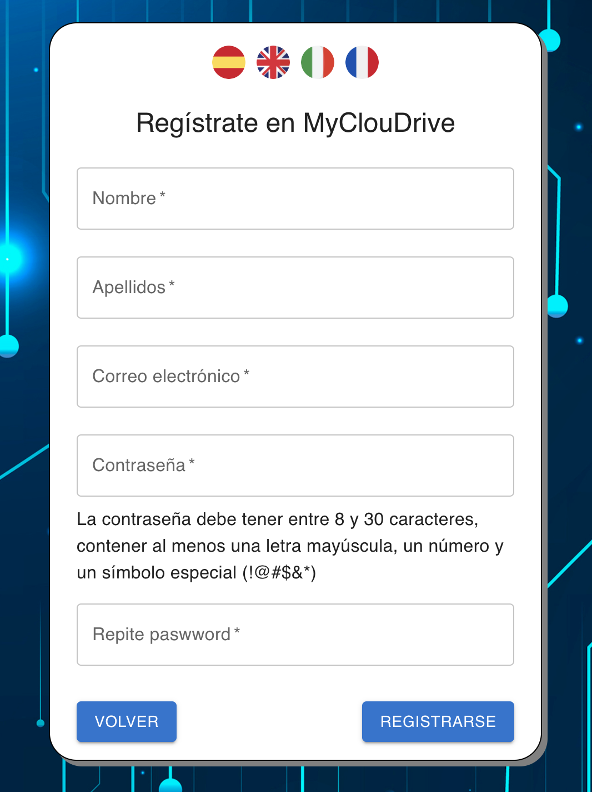
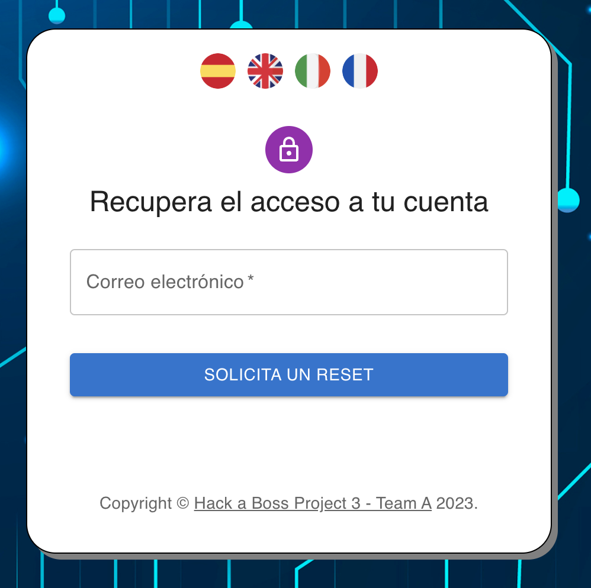
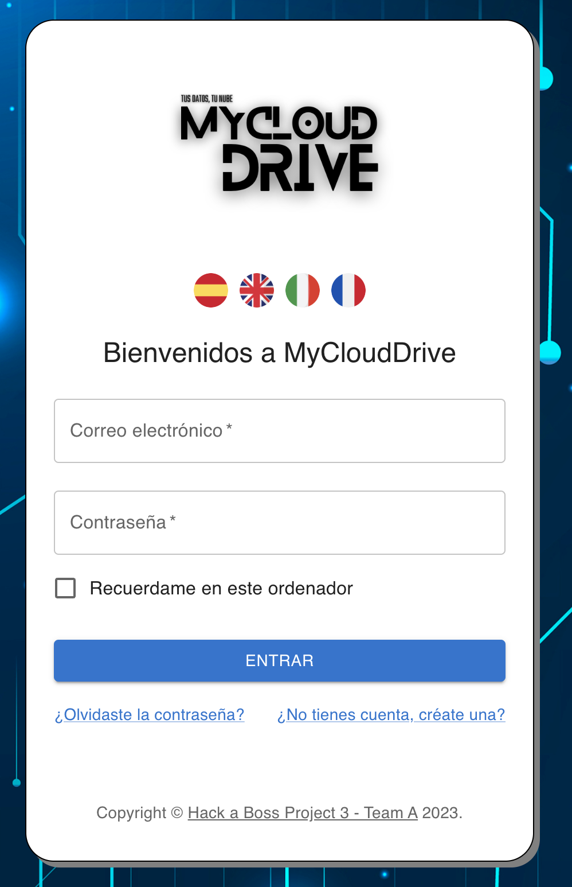
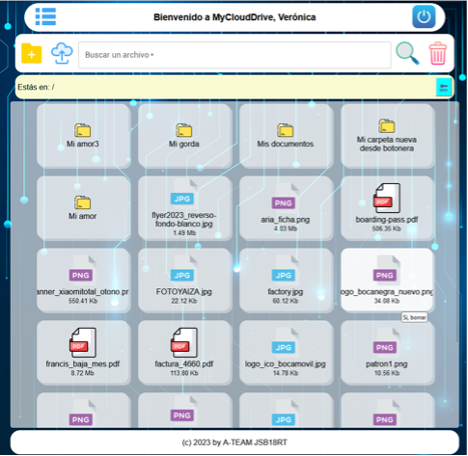

#  ......👨‍💻 **********************************⌬⎨ < ☁ MyCloudDrive ☁ > ⎬⌬********************************** 👨‍💻......

El siguiente proyecto está siendo desarrollado por los alumnos del grupo A 📝 del Bootcamp de Desarrollo web; en este nuevo proyecto estaremos desarrollando el front de nuestra aplicación 💻.

Realizaremos la conexión con nuestro Backend en el cual mediante servicios, hooks y los adecuados componentes en el Frontend nos permitirán tener una eperiencia más dinámica y visual.

## 🟢 Información Backend

    - Se debe entrar en la carpeta "back" y hacer npm i.
    
    - Arrancar con npm run start.

    - Se debe registrar la variable en el fichero .env con el localhost apuntando a nuestro Backend.

## 🔵 Información Frontend

    - Se debe entrar en la carpeta "front" y hacer npm i.
    
    - Arrancar con npm run dev.

### *** Librerías instaladas ***

    - react-router-dom

    - Swal (sweet alert) para diálogos y mensajes modales y toast

    - react-intl (para internacionalización)

    - Material UI (para todo el diseño de interfaz de usuario en FRONT)

    - JOI (validaciones de campos por RegEx)

    - compressing (para compresión en .tar de carpetas para su descarga)

# Funcionalidades elaboradas:

    🖥️ - Se crea un front inicial de login y register.
    
    👤 - Se permite la edición de los datos personales.
    
    🎬 - Se permite la subida, descarga y borrado de archivos.

    🗂️ - Se habilita la posibilidad de creación de carpetas para la clasificación de tus archivos.

    🌎 - Se habilitan los idiomas 🇪🇸 🇬🇧 🇮🇹 🇫🇷.

# Instrucciones de creación del fichero .env

    - HOST = {Host de la base de datos.}

    - USER = {Usuario bd.}

    - PASSWORD = {Password de la bd.}

    - DATABASE = {Nombre de la bd.}

    - SENDGRID_API_KEY = {Api key de vuestra cuenta de sendgrid, inmpresindible para probar el funcionamiento de los correos que la app envía.}

    - SENDGRID_FROM = {Correo válido registrado como remitente en sendgrid.}

    - PUBLIC_HOST = {http://localhost:5173/validate <- Poner otro puerto si al arrancar vite asigna otro puerto distinto.}

    - ROOT_DIR = {./src/uploads <- Este valor debe mantenerse.}

    - SECRET_TOKEN = {Una cadena de longitud variable alfanumérica que se usará como semilla en la generación de tokens.}

    

#   *********  Manual de uso de la aplicación ********* 

##   

    
    En MyCloudDrive podéis registraros, logearte, subir archivos, desacargarlos, crear carpetas, eliminarlas. Te explicamos paso a paso como podéis utilizarla:

    1- Registra una cuenta
    
        Lo primero es registrarte en nuestra plataforma, para ello, haz click en el enlace “¿No tienes cuenta, créate una?” de la pantalla principal y accederás a un sencillo formulario de registro, donde sólo te pediremos nombre, apellidos, correo electrónico y una contraseña.
##        

    2- Consigue tu código de validación

        Tras el registro, recibirás un e-mail en el correo usado con un enlace para validar tu cuenta, haz click en él (o copia y pega el enlace en tu navegador) y haz click en “validar” (el código de registro ya se rellena solo) y listo, tu usuario quedará validado y podrás entrar en nuestra app.

    3- ¿Olvidaste tu contraseña?

        No hay problema, pulsa en el enlace “¿Olvidaste tu contraseña?” para poder recuperarla rápidamente a través de un código de un solo uso que será enviado al e-mail de tu usuario.
##        

    4- Haz Login.

        Listo, una vez que ya te has validado, podrás hacer Login y verás la ventana principal.
##         
        En la parte superior tendrás un menú (lado izquierdo) y el botón para cerrar sesión, luego, en la barra de búsqueda tienes los botones de crear carpeta y subir un fichero, además del buscador de ficheros y el botón para acceder a tu papelera de reciclaje.
        En la vista intermedia estarán tus archivos y carpetas.

    5- Opera con tus ficheros.

        Podrás crear carpetas y crear otras carpetas dentro de las carpetas, ¡sin límite de profundidad!, podrás subir ficheros y moverlos y por supuesto, borrarlos y descargarlos con un doble click.
        Para entrar en las carpetas, usa el doble click.
        Con el botón derecho del ratón (o pulsación prolongada en el móvil) podrás acceder a los menús contextuales, dependiendo donde piques, verás un menú u otro. Ayúdate con sus opciones para operar por tu disco duro.
        Podrás descargar carpetas, éstas se comprimen antes de bajarse para que te ocupen menos espacio y te traerás todo su contenido de golpe.
##  

    6- El menú lateral.

        Utiliza el menú lateral para hacer algunas operaciones básicas, ver nuestro “acerca de” o la opción para completar tu perfil.

**************************************** *************************************

## Opinión de los integrantes en el desarrollo de la App

 🗣️ - MyCloudDrive ha sido un proyecto de final de bootcamp muy interesante, donde se ha puesto en práctica todo lo aprendido durante este apasionante curso. No ha estado exento de dificultades y de vaivenes y sabemos que hemos hecho más de lo que se solicitaba con el riesgo que eso conlleva a entregar un producto con errores, pero creo que lo hemos depurado bastante bien y bueno, obviando que pudiera salir alguna cosilla por ahí y que por supuesto es altamente mejorable, estoy muy orgulloso del producto final. Gracias a mis compañeros que han estado apoyando y aportando ideas y código, este proyecto es hoy una realidad.

 🗣️ - El desarrollo de este último proyecto ha sido todo un logro, en el cual se puso en práctica los conocimientos obtenidos para el desarrollo del back y sus mejoras, así como el front con el cual pudimos practicar nuevas funcionalidades aprendidas, además de los retos que supone el arrancar por primera vez una aplicación, que bien es cierto se las trae en sus puntos álgidos de gran dificultad. Sin embargo, hemos logrado alcanzar lo solicitado y algunos puntos adicionales que esperamos les sean de su agrado.

 🗣️ - Pues echando la vista atrás...hemos aprendido un huevo! Y lo que queda, lo que me queda muchos mas claro a dia de hoy es que React es un mundo aparte, del cual en clase hemos visto lo justo. Como soy un inconformista pues diré que me queda mucho por mejorar, pero bueno ha sido un placer haber compartido con vosotros estas 4 semanas de proyecto, (aparte de todo el curso). Y a partir de ahora pues a seguir practicando para llegar a ser unos buenos programadores (Mario ya lo es). Y me da pena la verdad, que esto se ha acabado!!! En resumen, creo que presentamos un buen producto, sigo diciendo que viendo el resto me parece el más complido. Tendrá sus fallos , pero creo que el resultado final ha sido 👌

 🗣️ - Ha sido increíble poder acompañar a mis love coders en el difícil desarrollo de este aplicación de almacenamiento en la nube.
La verdad es que ha sido una experiencia de aprendizaje y también la mejor forma de saber todo lo que no sé, todo un mundo para seguir avanzando en el aprendizaje

# Tecnologías utilizadas

#    

